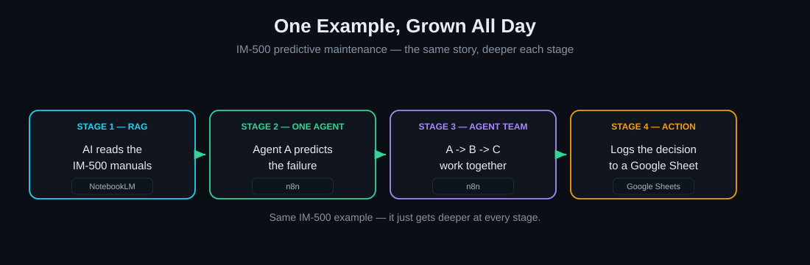
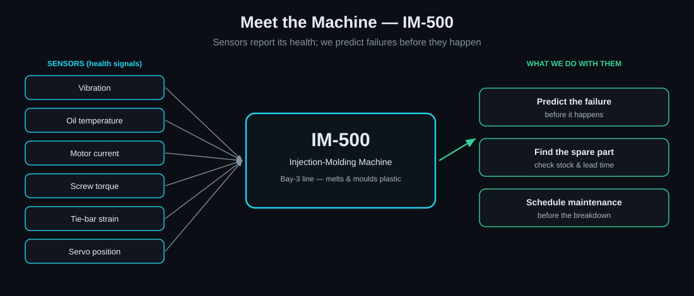
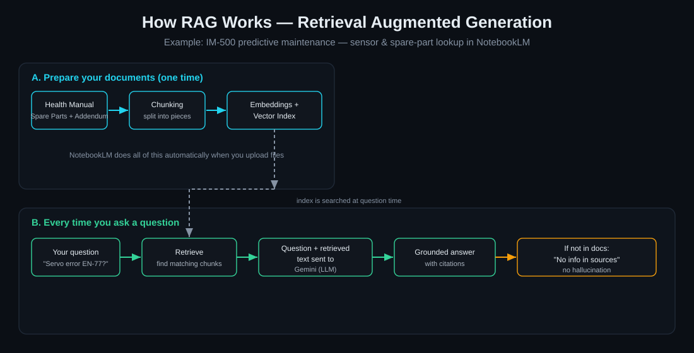
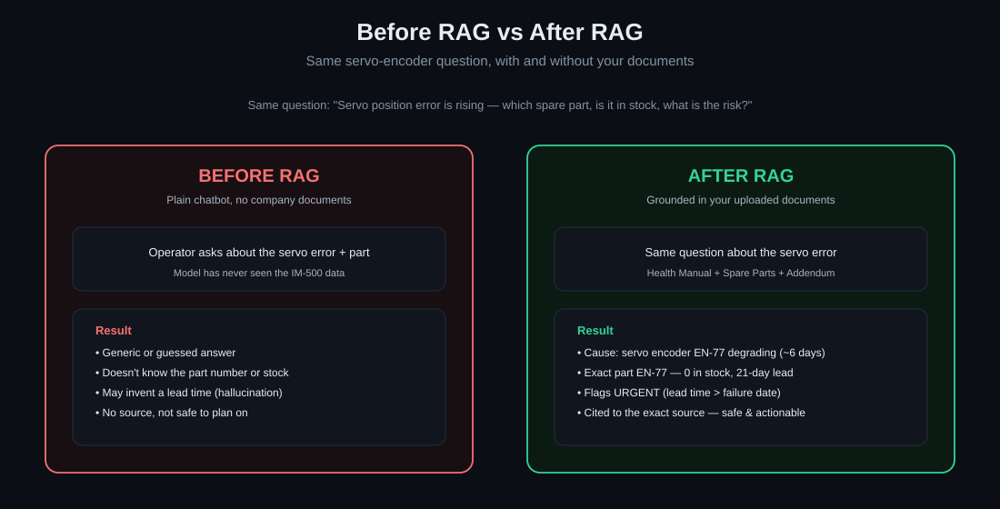
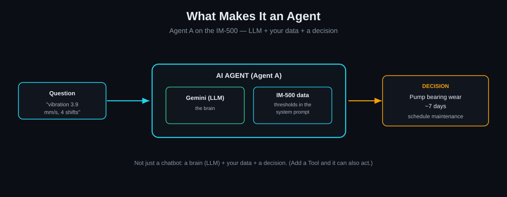
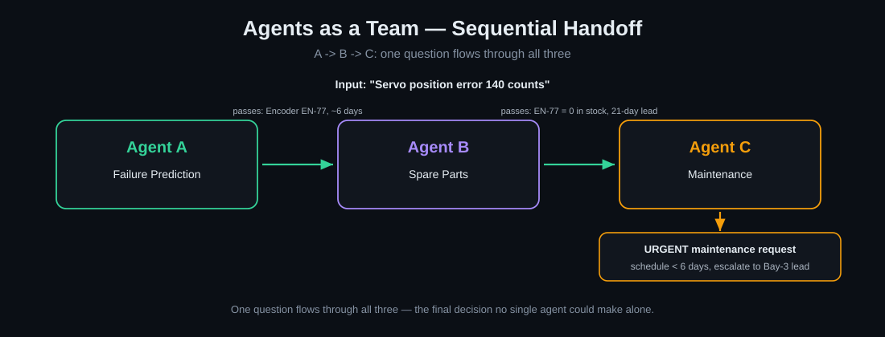
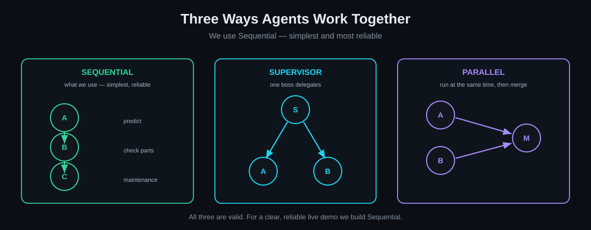
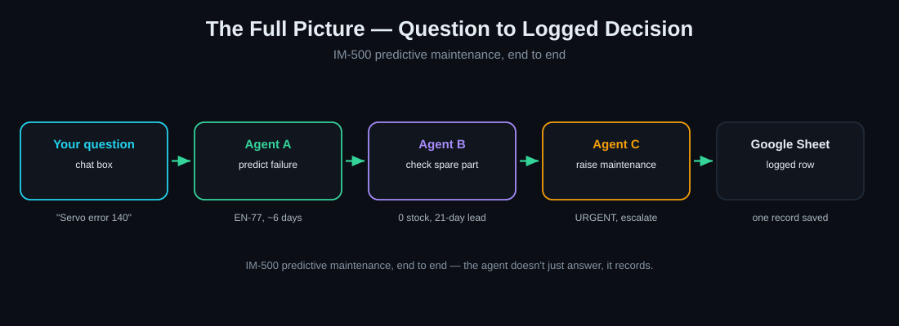

# LG Noida AI Training — Complete Manual

**Predictive Maintenance on an IM-500 machine · RAG → Agents → Orchestration → Google Sheet · all no-code**

> This is the single reference for the whole session — every concept, every step, every prompt, and the diagrams.
> The slide deck (`LG-AI-Training-4hr.pptx`) is the on-screen runbook; this manual is the detail behind it and the participant take-home.
> All code/prompt blocks are plain text — copy them exactly as shown.

---

## 1. What you'll build

One example, grown across the session:



| Agent | Job | Input → Output |
|---|---|---|
| A — Failure Prediction | Predicts a failure from a sensor reading | sensor value → failing part + days to failure |
| B — Spare Parts | Checks the part's stock & lead time | failing part → stock, lead time, order decision |
| C — Maintenance | Raises the maintenance request | prediction + parts → scheduled request + priority |

**End-to-end:** `RAG → your question → Agent A → Agent B → Agent C → Google Sheet`

---

## 2. The machine — IM-500



The **IM-500** is a plastic injection-molding machine on the Bay-3 line — it melts plastic and injects it into a mould to make parts. Its sensors (vibration, temperature, motor current, screw torque, tie-bar strain, servo position) reveal its health. The whole example: read those sensors → predict a failure → find the spare part → schedule maintenance before it breaks.

---

## 3. Glossary (plain language)

- **RAG (Retrieval-Augmented Generation)** — Give the AI your documents; it answers only from them, with citations, instead of guessing. Prevents "hallucination".
- **LLM** — The "brain": a large language model that understands and writes language (e.g. Google Gemini).
- **AI Agent** — An LLM given reference data and the ability to decide/act. (Our Agents A/B/C.)
- **Agentic AI / Orchestration** — Several agents coordinating; wiring them so one hands off to the next. We use a sequential pipeline A → B → C.
- **System prompt** — The standing instructions baked into an agent — its role plus the reference data it must use.
- **Structured output** — Forcing the AI to answer in fixed fields (part, priority, days…) so the result drops straight into a spreadsheet.
- **EN-77** — Star of the demo: a servo encoder, 0 in stock, 21-day supplier lead time but ~6 days to failure → always URGENT, escalate.
- **Lead time** — Two kinds: *failure* lead time (days until the machine fails) vs *part supply* lead time (days to get the spare).
- **Credential / API key / rate limit** — A saved secret that lets one tool use another; the free quota is per-model per-day (see section 9).

---

## 4. Accounts & setup — from zero (do once)

> Complete these before the session. Screens change over time; if a button's wording differs, follow the on-screen prompt — the flow is always **create / sign in → verify → land on the home page**.

### 4.1 A Google account
- Use a personal Gmail or your own domain — **not** a locked corporate account (it may block Labs tools).
- Don't have one to spare? `accounts.google.com` → **Create account** → follow the prompts.
- This one login covers **NotebookLM, Google AI Studio (the Gemini key), and Google Sheets**.

### 4.2 Google AI Studio — get the free Gemini API key
1. Go to `aistudio.google.com` → **sign in** with your Google account.
2. Accept the terms if prompted (first visit only).
3. Click **Get API key** (top-right, or the "API keys" item in the left menu).
4. Click **Create API key** → let it create the key in a new project (or pick an existing one).
5. **Copy the key** and save it somewhere safe — you'll paste it into n8n. Treat it like a password.
- The key draws on this Google account's free daily quota (see section 9). Keep the tab handy in case you need a second key.

### 4.3 n8n Cloud — create the account
1. Go to `n8n.io` → click **Get started** / **Start free trial**.
2. Sign up with **email** (or **Continue with Google**). For email: enter email + password.
3. **Verify your email** — open n8n's confirmation email and click the link.
4. Finish the short onboarding (name + a couple of questions). If it asks for a *work* email and you only have personal, your own domain works; a personal Gmail is usually accepted on the trial.
5. n8n provisions your **cloud instance** — you land on a URL like `https://<yourname>.app.n8n.cloud/`. This is your **workflows home**. Bookmark it.
- The free trial is time-limited, so create the account within a few days of the session.

### 4.4 NotebookLM — sign in
1. Go to `notebooklm.google.com`.
2. Click **Try NotebookLM** / **Sign in** → choose your Google account.
3. Accept the terms on first use. You land on the notebooks home — **Create new** starts a notebook.
- No install and no API key — it just uses your Google login.

### 4.5 Google Sheets
- Already covered by your Google login. When you reach section 10: `sheets.google.com` → **Blank spreadsheet**.

**Quick checklist before the session:** Google account ready · Gemini API key copied & saved · n8n cloud URL bookmarked & logged in · NotebookLM opens to the home page · you can create a blank Google Sheet.

---

## 5. Stage 1 — RAG in NotebookLM (exact steps)



> **Why NotebookLM?** No-code, free, Google-stable — upload PDFs and ask; no database to manage. Best "just works" tool for grounded answers.

**The three source PDFs** (in `RAG_NotebookLM_Uploads/`):

- `IM500_MachineHealth_FailurePrediction_Manual.pdf` — Agent A manual
- `IM500_SpareParts_Inventory_Catalog.pdf` — Agent B catalog
- `IM500_Predictive_Addendum.pdf` — the EN-77 addendum (upload **last**)

### The before/after demo — exact sequence

The question we ask each time:

```
Servo position error is rising on the IM-500 - which spare part is it, is it in stock, and what is the risk?
```

**State 1 — Before RAG (plain chatbot).** Open `gemini.google.com` (no documents). Ask the question. → It guesses: no part number, no stock, maybe an invented lead time. Not safe to act on.

**State 2 — RAG, addendum withheld.** Open `notebooklm.google.com` → **Create new** notebook, name it "IM-500" → **Add sources** → upload **only**:
- `IM500_MachineHealth_FailurePrediction_Manual.pdf`
- `IM500_SpareParts_Inventory_Catalog.pdf`

Ask the same question. → It honestly answers **"not in the sources"** for the servo encoder, because EN-77 lives only in the addendum. This is the no-hallucination moment.

**State 3 — RAG, complete.** Add `IM500_Predictive_Addendum.pdf` as a source. Ask the same question again. → Full grounded answer, **cited**: servo encoder EN-77, 0 in stock, 21-day lead, ~6 days to failure → URGENT, escalate.



> The trick: EN-77's data exists *only* in the addendum. Withholding it gives the clean "not found → then found, cited" contrast. NotebookLM won't chat with zero sources, so use plain Gemini for the "before" state.

---

## 6. n8n in 60 seconds

- **Workflow** — one automation on one canvas.
- **Node** — one step; wired left → right.
- **Trigger** — the first node; we use **Chat Trigger** (a live chat box).
- **AI Agent node** — the brain; plug sub-nodes underneath: **Chat Model** (the LLM, required), optional **Memory**, **Tool**, **Output Parser**.
- **Credential** — a saved secret (API key / Google login), saved once, reused.

> The AI Agent no longer has an "agent type" setting (removed in n8n v1.82). Every AI Agent is a "Tools Agent" automatically.

---

## 7. Stage 2 — Build the agents



> **Why n8n?** No-code, free tier, browser-based — no servers, no licences. (Copilot Studio needed a licence we don't have.)

### 7.1 Agent A — Failure Prediction

1. Workflows home → **Create Workflow** → rename "Agent A — Failure Prediction".
2. **+** → **When chat message received** (Chat Trigger).
3. On the trigger, **+** → **AI Agent**.
4. Under **Chat Model** → **+** → **Google Gemini Chat Model** → create credential (paste API key) → pick a stable Flash model (see section 9).
5. Double-click the AI Agent → **Prompt** = "Take from previous node automatically" → **Options → Add Option → System Message** → paste the Agent A prompt below.
6. **Save** → **Open Chat** → test: `vibration 3.9 mm/s for 4 shifts`.

```
You are the Failure Prediction Agent for IM-500 injection molding (Bay 3). Predict failures from sensor readings using ONLY this reference. If not covered, say so - don't guess.

Thresholds (Normal / Warning / Critical -> cause, lead time):
- Vibration mm/s: <2.8 / 2.8-4.5 / >4.5 -> pump bearing wear, ~7d
- Oil temp C: <50 / 50-60 / >60 -> pump/cooling wear, ~10d
- Heater drift C: +/-5 / 5-10 / >10 -> heater band ageing, ~14d
- Motor current A: 18-24 / 24-28 / >28 -> overload, ~5d
- Screw torque %: <70 / 70-85 / >85 -> screw/barrel wear, ~12d
- Tie-bar strain uE: <800 / 800-1000 / >1000 -> tie-bar wear, ~9d
- Servo error counts: <50 / 50-120 / >120 -> encoder EN-77, ~6d

Rules: Warning = predicted failure; Critical = immediate. Schedule maintenance before (today + lead time).
Output: failing component, lead time, urgency.
```

> Read the **chat bubble**, not the raw output panel — raw shows escaped `\n` and `*`, which is normal.

> **Note on outputs:** these are AI-generated, so the exact wording and formatting vary slightly from run to run. The parts that matter — component, lead time, part number, priority — stay consistent. This applies to every agent below and to the orchestration.

**Agent A — samples**

Sample 1 (Warning):
```
INPUT:  Hydraulic pump vibration has been 3.9 mm/s across the last 4 shifts.

OUTPUT: Failing component: Hydraulic pump bearing
        Lead time: ~7 days
        Urgency: Warning (predicted failure) - vibration is in the 2.8-4.5 band for 3+ shifts. Schedule before day 7.
```

Sample 2 (Critical):
```
INPUT:  Main motor current is reading 30 A.

OUTPUT: Failing component: Drive motor / mechanical overload
        Lead time: ~5 days
        Urgency: Critical - 30 A is above the 28 A threshold. Immediate; schedule now, before day 5.
```

### 7.2 Agent B — Spare Parts

Same steps, new workflow. Reuse the same Gemini credential. Paste this system message:

```
You are the Spare Parts Agent for IM-500 (Bay-3 store). Given a failing component/part, return the exact part + stock using ONLY this reference. Don't invent parts or stock.

Component -> Part No (stock / min / lead / status):
- pump bearing -> BR-3105 (4/2/5d OK)
- pump seal -> SK-4620 (1/2/7d LOW)
- barrel heater -> HB-220 (3/2/6d OK)
- thermocouple -> TC-11 (0/1/4d OUT)
- cooling circuit -> CF-08 (6/3/3d OK)
- injection screw -> ST-90 (0/1/15d OUT)
- ejector -> EP-12 (2/1/5d OK)
- servo drive fan -> FN-40 (1/1/9d OK)
- servo encoder -> EN-77 (0/1/21d OUT)

Rules: stock < min -> reorder. If failure sooner than lead time -> URGENT/expedite. EN-77 always URGENT (21d lead vs ~6d failure), escalate to Bay-3 lead.
Output: part no, stock, lead time, reorder/urgent decision.
```

**Agent B — samples**

Sample 1 (in stock, normal):
```
INPUT:  Failing hydraulic pump bearing - what's the part and is it in stock?

OUTPUT: Part: Bearing BR-3105
        In stock: 4 (min 2) - above minimum, no reorder needed
        Lead time: 5 days
        Decision: OK - part available.
```

Sample 2 (out of stock, urgent):
```
INPUT:  Servo encoder EN-77, failure predicted in about 6 days.

OUTPUT: Part: Servo encoder EN-77
        In stock: 0 (min 1) - OUT
        Lead time: 21 days (supplier OEM-Korea)
        Decision: URGENT - 21-day lead exceeds the ~6-day failure. Expedite and escalate to the Bay-3 lead.
```

### 7.3 Agent C — Maintenance (with structured output)

1. New workflow → build like B → paste the Agent C system message below.
2. In the Agent C node, turn **ON** "Require Specific Output Format" (bottom of Parameters). An **Output Parser** slot appears.
3. Under it → **+** → **Structured Output Parser** → Schema Type = **Generate From JSON Example** → paste the JSON below.

```
You are the Maintenance Agent for IM-500 injection molding (Bay 3). You receive a predicted failure and its spare-part status. Raise a maintenance request using ONLY that input - don't invent details.

Keep two numbers separate: FAILURE lead time (days to failure) vs PART supply lead time (days to get the part).
Rules:
- schedule_by_days must be LESS than failure_days (schedule before failure). Never use the part supply lead time as the schedule date.
- If part out of stock OR part supply lead time > failure lead time -> priority URGENT, note escalation in summary.
- Otherwise NORMAL.

Output these fields:
- machine: "IM-500 (Bay 3)"
- component: EXACTLY one of: Servo Encoder EN-77, Hydraulic Pump Bearing, Injection Screw, Barrel Heater Band, Cooling Circuit, Hydraulic Pump Seal, Thermocouple
- part: part code ONLY (e.g. EN-77)
- in_stock: number only
- failure_days: number
- schedule_by_days: number, less than failure_days
- priority: EXACTLY "URGENT" or "NORMAL" - no notes
- summary: one-line request; put any escalation note HERE
```

```json
{
  "machine": "IM-500 (Bay 3)",
  "component": "Servo Encoder EN-77",
  "part": "EN-77",
  "in_stock": 0,
  "failure_days": 6,
  "schedule_by_days": 6,
  "priority": "URGENT",
  "summary": "Raise URGENT maintenance; EN-77 out of stock, 21-day lead exceeds 6-day failure - escalate."
}
```

> **Keep it clean:** `priority` must be exactly URGENT/NORMAL, `part` the code only, `component` from the fixed list — put notes in `summary`. Otherwise the logged sheet gets messy.

**Agent C — samples** (Agent C receives Agent A + Agent B output; here we feed it directly to test it alone)

Sample 1 (urgent):
```
INPUT:  Predicted failure: servo encoder EN-77 degrading, failure in ~6 days.
        Part EN-77 is 0 in stock, 21-day supplier lead time.

OUTPUT: {
          "machine": "IM-500 (Bay 3)",
          "component": "Servo Encoder EN-77",
          "part": "EN-77",
          "in_stock": 0,
          "failure_days": 6,
          "schedule_by_days": 6,
          "priority": "URGENT",
          "summary": "EN-77 out of stock; 21-day lead exceeds 6-day failure - schedule within 6 days and escalate to Bay-3 lead."
        }
```

Sample 2 (normal):
```
INPUT:  Predicted failure: hydraulic pump bearing wear, failure in ~7 days.
        Part BR-3105 is 4 in stock, 5-day lead time.

OUTPUT: {
          "machine": "IM-500 (Bay 3)",
          "component": "Hydraulic Pump Bearing",
          "part": "BR-3105",
          "in_stock": 4,
          "failure_days": 7,
          "schedule_by_days": 6,
          "priority": "NORMAL",
          "summary": "BR-3105 in stock, 5-day lead covers the 7-day failure window - schedule within 7 days."
        }
```

---

## 8. Stage 3 — Orchestration (A → B → C)



A pipeline lives on one canvas — don't rebuild, copy the agents in:

1. Open Agent A workflow → click the AI Agent node, then **Ctrl-click** its Gemini model node (both selected) → **Ctrl+C**.
2. New workflow "Orchestration (A→B→C)" → **Ctrl+V**. Repeat for B and C.
3. Rename nodes: **Agent A**, **Agent B**, **Agent C**.
4. Add a Chat Trigger. Wire: **Chat Trigger → Agent A → Agent B → Agent C**.
5. Set each agent's **Prompt**:

```
Agent A:  Prompt = "Take from previous node automatically"

Agent B:  Prompt = "Define below" (Expression):
          {{ $json.output }}

Agent C:  Prompt = "Define below" (Expression):
          Predicted failure: {{ $('Agent A').first().json.output }}
          Parts status: {{ $('Agent B').first().json.output }}
```

> Use `.first()`, not `.item`, when referencing Agent A from Agent C — Agent A is two nodes back, and `.item` returns blank across two hops.



**Test:** Open Chat → `Servo position error is now 140 counts and rising` → A predicts EN-77 → B flags 0 stock / 21-day lead → C raises an URGENT request, escalate.

**Orchestration — samples** (one chat input flows A → B → C; the final answer is Agent C's)

Sample 1 (urgent path):
```
INPUT:  Servo position error is now 140 counts and rising.

FLOW:   A -> Servo Encoder EN-77, ~6 days (Critical)
        B -> EN-77, 0 in stock, 21-day lead, URGENT
        C (final) ->
        {
          "machine": "IM-500 (Bay 3)",
          "component": "Servo Encoder EN-77",
          "part": "EN-77",
          "in_stock": 0,
          "failure_days": 6,
          "schedule_by_days": 6,
          "priority": "URGENT",
          "summary": "EN-77 out of stock; 21-day lead exceeds 6-day failure - schedule within 6 days, escalate to Bay-3 lead."
        }
```

Sample 2 (normal path):
```
INPUT:  Hydraulic pump vibration has been 3.9 mm/s for the last 4 shifts.

FLOW:   A -> Hydraulic Pump Bearing, ~7 days (Warning)
        B -> BR-3105, 4 in stock, 5-day lead, OK
        C (final) ->
        {
          "machine": "IM-500 (Bay 3)",
          "component": "Hydraulic Pump Bearing",
          "part": "BR-3105",
          "in_stock": 4,
          "failure_days": 7,
          "schedule_by_days": 6,
          "priority": "NORMAL",
          "summary": "BR-3105 in stock, 5-day lead covers the 7-day window - schedule within 7 days."
        }
```

Run Sample 1 vs Sample 2 back to back — URGENT vs NORMAL from the same pipeline proves the agents are reasoning, not scripted. Each of these also appends one row to the Google Sheet (section 10).

---

## 9. Choosing the model & free daily limits

The free Gemini tier caps requests **per-model, per-day**. Each orchestration run = 3 requests (one per agent).

| Model type | Free requests/day | Use it? |
|---|---|---|
| Preview (e.g. `gemini-3-flash-preview`) | ~20 / day | No — out in ~6 runs |
| Stable Flash (e.g. `gemini-3.6-flash`) | ~1,500 / day | Yes — ~500 runs/day |

> **"429 Too Many Requests"** = that model's daily quota is spent. The cap is per-model — switch each agent's Chat Model to a *different* stable model and you get a fresh quota immediately. No new key/account needed. If a model says "no longer available," use the replacement named in the error, then lock it in.

---

## 10. Stage 4 — Log the decision to a Google Sheet

> **Why a Sheet, not email?** A sheet is a permanent record you can filter, sort and share; email is a one-off notification. The Sheet is the source of truth.

**10.1 Create the sheet** — `sheets.google.com` → blank → name it `IM500_Maintenance_Log`. Row 1 headers (A1–H1):

```
Timestamp | Machine | Failing Component | Part No | In Stock | Failure In (days) | Schedule By (days) | Priority
```

**10.2 Add the Google Sheets node**

1. In the orchestration workflow → add node → **Google Sheets** → **Sign in with Google** → allow access.
2. Operation = **Append Row**; Document = `IM500_Maintenance_Log`; Sheet = `Sheet1`; Mapping = **Map Each Column Manually**.
3. Wire **Agent C → Google Sheets**. Map each column (toggle each to Expression):

```
Timestamp          {{ $now }}
Machine            {{ $json.output.machine }}
Failing Component  {{ $json.output.component }}
Part No            {{ $json.output.part }}
In Stock           {{ $json.output.in_stock }}
Failure In (days)  {{ $json.output.failure_days }}
Schedule By (days) {{ $json.output.schedule_by_days }}
Priority           {{ $json.output.priority }}
```

Run the chat → a new row appears in the sheet. That's the agent taking a real action.



---

## 11. Troubleshooting

| Symptom | Cause & fix |
|---|---|
| NotebookLM says "not in sources" | Expected before you upload the relevant PDF — the no-hallucination behaviour. Add the source and re-ask. |
| "No prompt specified / expected chatInput" | A downstream agent's Prompt is still "Take from previous node automatically". Set it to "Define below" + the expression. |
| Agent C shows "Not specified" for failure fields | Used `.item` across two hops. Use `$('Agent A').first().json.output`. |
| 429 Too Many Requests | Model's daily quota spent. Switch to a different stable model (section 9). |
| Model 404 "no longer available" | Model retired. Use the replacement named in the error (e.g. `gemini-3.6-flash`). |
| Sheet shows messy values | Agent C output isn't clean — force `priority` to URGENT/NORMAL and `part` to the code only (7.3). |
| Output looks like `\n` and `*` | You're reading the raw panel. Read the chat bubble. |

---

## Appendix — Test inputs & cheat sheet

| Stage | Type this | Expect |
|---|---|---|
| RAG | Servo position error is rising - which part, in stock, what's the risk? | Before addendum: "not in sources". After: EN-77, 0 stock, 21d, urgent, cited. |
| Agent A | vibration 3.9 mm/s for 4 shifts | pump bearing, ~7d |
| Agent A (grounding) | What's the coolant pressure threshold? | refuses - not in reference |
| Agent B | Which parts are out of stock? | TC-11, ST-90, EN-77 |
| Full chain | Servo position error is now 140 counts and rising | EN-77 → 0 stock, 21d → URGENT, escalate |

**Cheat sheet:** RAG needs only a Google login; agents need the Gemini key + n8n. Multi-select = Ctrl-click. Only the first agent uses "Take from previous node automatically". Two hops back → `.first()`. Stable model, not preview. Google Sheets = Append Row + Manual mapping. Keep Agent C's `priority`/`component` clean.

**Key URL:** n8n workflows home — https://arjunthakurdev.app.n8n.cloud/home/workflows
